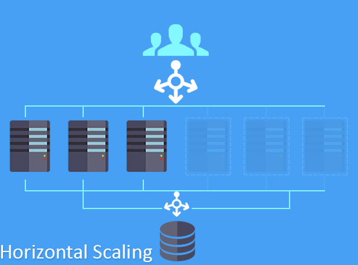

---

layout: ribbon

style: |

    #Cover h2 {
        margin:30px 0 0;
        color:#FFF;
        text-align:center;
        font-size:70px;
        }
    #Cover p {
        margin:10px 0 0;
        text-align:center;
        color:#FFF;
        font-style:italic;
        font-size:20px;
        }
        #Cover p a {
            color:#FFF;
            }
    #Picture h2 {
        color:#FFF;
        }
    #SeeMore h2 {
        font-size:100px
        }
    #SeeMore img {
        width:0.72em;
        height:0.72em;
        }
---

# Cloud development paradigm {#Cover}

*David Kubec @ [vsechnovcloudu.cz](http://vsechnovcloudu.cz/) powered by [Jekyller](https://github.com/shower/jekyller)*

## **Jádro pudla** {#start}

## Pic
{:.cover #Picture}

## Cloud = elasticita {#cloud}
Misto vlastnictví serverů jen **pronajímáme zdroje**.  
Virtuální hardware **neomezeně škáluje** (o přidávání fyzického hardwaru se nestaráme).  
Služby nabízené cloud providerem **zásadně zjednodušují a zrychlují** procesy.   
Platíme **pouze** za to, co doopravdy zkonzumujeme (účtováno obvykle po vteřinách).  

## **A praktický dopad?** {#impact}

## Infrastruktura není tím, co bývala {#server}

## Infrastruktura je software! {#software}

    resource "aws_instance" "web" {
      ami           = "${data.aws_ami.ubuntu.id}"
      instance_type = "t2.micro"
      subnet_id     = "${var.SUBNET}"

      tags {
        Name = "My server"
      }
    }

## **Automate everything!** {#automatizace}

## **.** {#autoscaling}

## Atomické procesy {#atomic}

Místo **jednolitého monolitu** pro pevně daný počet uživatelů...  

…... budujeme proces přesně pro *jednoho uživatele*.  
**Cloud se stará o škálování na míru množství zákazníků.**  

…Atomické procesy se snáze a rychleji vyvíjí, testují, rozšiřují...

## **A co za to?** {#tradeoff1}

## Trade off {#tradeoff2}

Cloud provider nevidí **obsah** našich operací v cloudu, ale sleduje naši aktivitu.  
Na základě analýzy dat cloud provider **vylepšuje své služby**, čímž láká více zákazníků.  
Více zákazníků generuje **více aktivity** ... a tak dokola.  

## Cena {#price}

Cloud **není levný!**  
Do cloudu se **nemigruje**, cloud *adoptujete*.  
Prostý přesun datacentrum > cloud přinese **pramalý** benefit.    
*Začít v malém je základ.*  

## **Bezpečnost a soukromí** {#security}

## Nové nároky {#requirements}

Ukládání a přenos dat vyžaduje **šifrování**, jako *výchozí* nastavení.  

Od samotného počátku je potřeba stanovit transparentní strukturu kontrolních mechanismů (self-service jako *výchozí* stav).

Konstantní monitoring veškerých zdrojů - krom bezpečnosti je to také hlavní zdroj analýz na další vylepšování produktu.

## **Sumarizace** {#summary}

## IT abstrakce {#abstraction}

1. …Hardware ... díky cloudu "jako" nemáme hardware.
2. …Operační systém ... díky kontajnerům "jako" nemáme operační systém.
3. …Server ... "server-less" = "jako" nemáme server.
4. …**Aplikace + konfigurace** ( = to jediné, co nás vlastně zajímá).

## Nová pracovní kultura {#culture}

Dříve rozdělené **DEV** a **OPS** se nyní slučují = všechno je software!  

Jednotný proces pro sledování a propagaci změn v aplikaci i infrastruktuře.  

Atomické zpracování dat vede k **jednodušší a spolehlivější aplikaci**, v ideálním případě bez závislosti na konkrétním poskytovatelem cloudu.  
Vývoj aplikace **nikdy nekončí**, *pořád je co vylepšovat*.  

## **vsechnovcloudu.cz** {#end}
